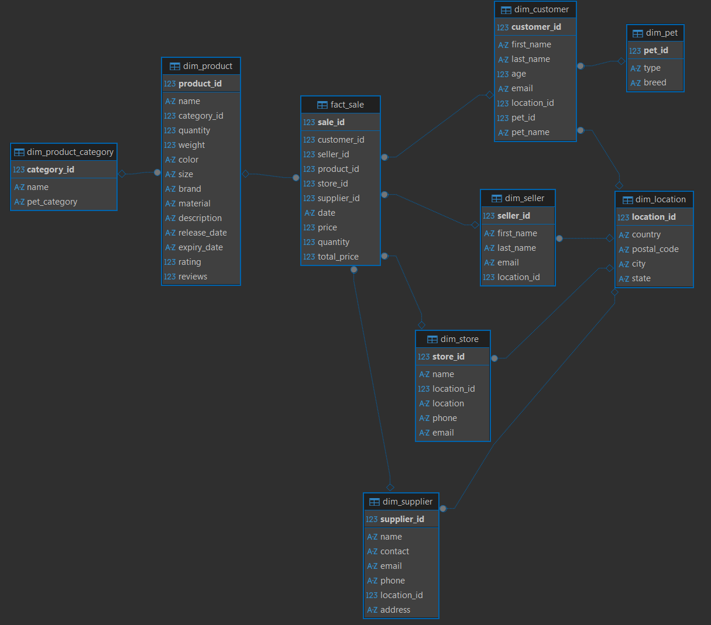

# Условие лабораторной работы
## BigDataSnowflake
Анализ больших данных - лабораторная работа №1 - нормализация данных в снежинку

Одна из задач data engineer при работе с данными BigData трансформировать исходную модель данных источника в аналитическую модель данных. Аналитическая модель данных позволяет исследовать данные и принимать на основе полученных данных решения. Классическими универсальными схемами для анализа данных являются "звезда" и "снежинка". В лабораторной работе вам предстоит потренироваться в трансформации исходных данных из источников в модель данных снежинка.

Что необходимо сделать?

Необходимо данные источника (файлы mock_data.csv с номерами), которые представляют информацию о покупателях, продавцах, поставщиках, магазинах, товарах для домашних питомцев трансформировать в модель снежинка (факты и измерения с нормализацией).

# Запуск
1. Клонируете к себе этот репозиторий.
   ```bash
   git clone <ссылка на репозиторий>
   ```
2. Устанавливаете себе инструмент для работы с запросами SQL (рекомендую DBeaver).
3. Запускаете базу данных PostgreSQL через запуск контейнера docker.
   ```bash
   docker-compose up
   ```
4. Открываем папку sql, загружаем скрипты в dbeaver и выполняем их по очереди.

## Описание скриптов
| Скрипт                          | Описание                                                   |
| ------------------------------- | ---------------------------------------------------------- |
| `1_import_raw_data.sql`         | Создание временной таблицы и импорт данных из CSV файлов   |
| `2_create_snowflake_tables.sql` | Создание нормализованных таблиц (dimension и fact таблицы) |
| `3_add_data_from_mock.sql`      | Перенос данных из сырой таблицы в финальную схему          |
| `4_test.sql`                    | Тестовые запросы для проверки корректности данных          |
Тестовые скрипты проверяют общее число данных в таблицах и выполняют аналитический запрос.

## Итоговая схема снежинки
